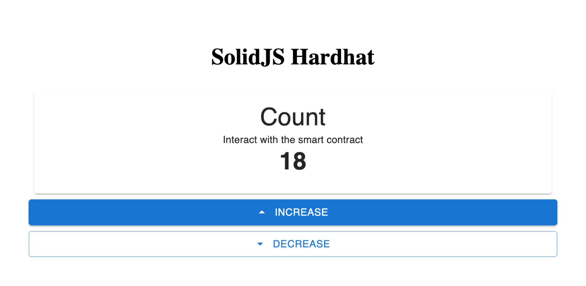

# Solid-Hardhat

My personal notes to create Hardhat, OpenZeppelin and SolidJS projects. User can increase and decrease the counter.



## Usage

1. Clone this repository and change into `solid-hardhat`. Then `npm install`. Then change into `frontend` and also run `npm install`.

2. Spin a blockchain network. For testing purposes, open a new terminal and change into `solid-hardhat` directory. Then, spin hardhat node `npx hardhat node`.

    Copy the private key of the first account - deployer of the smart contract.

3. Deploy smart contract `npx hardhat run scripts/deploy.ts`
Refer to the terminal when smart contract is deployed to get the smart contract's address.

    For example, the following is the output from my terminal:

    ```
    Contract deployment: Counter
    Contract address:    0xdc64a140aa3e981100a9beca4e685f962f0cf6c9
    Transaction:         0x6dd5afe0f5b732a27d7caeee49ebe47f2dbf8dffa9ab9a27d74b22ecc6ad5bd5
    From:                0xf39fd6e51aad88f6f4ce6ab8827279cfffb92266
    Value:               0 ETH
    Gas used:            214186 of 30000000
    Block #5:            0x4ee6c5dd186e65d1417dcde50b6b15c39bbb19ac978ef976f967c454896fbf7e
    ```

4. Edit the `.env` accordingly.

5. Then change into the `frontend` directory and run `npm run dev`.

## Steps to create this project.

This is my notes if I want to create a similar project to this `solid-hardhat`.

1. Create an empty directory, for example called `solid-hardhat`.
2. `npm init`
3. `npm install --save-dev hardhat`
4. `npx hardhat init`
5. Create SolidJS frontend app:

   `npm create vite@latest frontend -- --template solid-ts`

6. Add line `frontend/node_modules` in `.gitignore`.
7. Change into `frontend` and run the following command:
    
    `
    npm install --save-dev eslint eslint-plugin-solid @typescript-eslint/eslint-plugin @typescript-eslint/parser eslint-config-prettier eslint-plugin-prettier prettier
    `
8. `npm init @eslint/config`
    >To check syntax and find problems
    
    >JavaScript modules (import/export)
    
    >None of these
    
    >Does your project use TypeScript? › Yes
    
    >Browser
    
    >JavaScript

9. Add the following lines in the `hardhat.config.ts` file:

    ```
    paths: {
      artifacts: "./frontend/src/assets/artifacts",
    },
    ```

10. Install OpenZeppelin contract library `npm install @openzeppelin/contracts`.